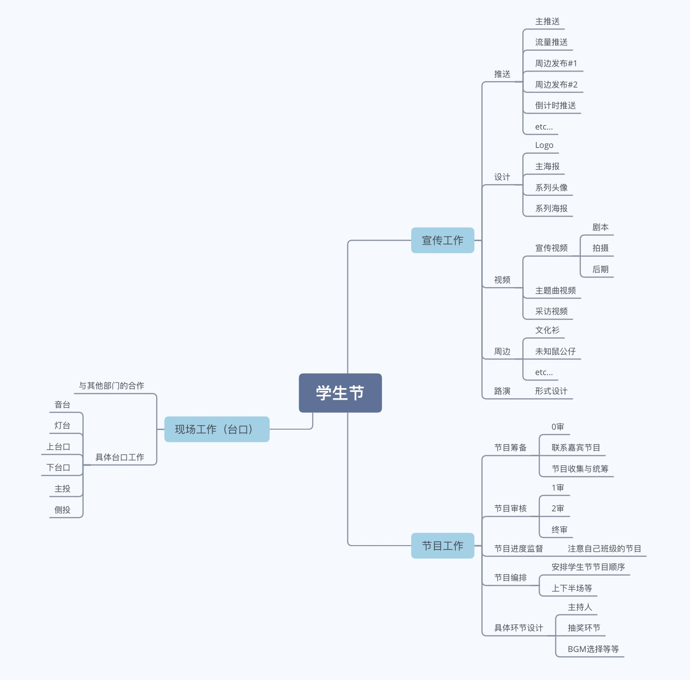

### 数学系文艺部弹射起步
这是正在进行的数学系学生会文艺部工作手册的一部分。此章节旨在使得春季学期新进入文艺部的同学们能够迅速的对数学系文艺部有一个了解。

#### 文艺部简介
作为数学系学生会的一个重要部门，数学系文艺部组织、筹办各种文艺活动，以培养同学们的文艺素养，发扬同学们的文艺特长。

**文艺部是一个快乐的部门**。在这里，我们致力于为同学们的生活添加文艺元素、让学习生活不再枯燥。如果用一句话概括文艺部的话，那一定是：「**带领着同学们和大家一起玩！**」我们希望能够将文艺部建设成一个大家有归属感的，开开心心的地方。

**文艺部也是一个有梦想的部门**。在文艺部这个平台上，大家因对文艺的热情而聚，也为了文艺梦想而努力。所以，大家可能会在文艺部中学到各种各样的技能，还可能会从更多的角度对文艺进行思考。如果大家能够有所收获，能够或多或少的实现自己的梦想，那就再好不过啦！

**文艺部是一个项目驱动的部门**。说了这么多，我们就来说说具体的事务吧。我们主要负责的大型活动有如下三个：春季学期的学生节，秋季学期的新生舞会，以及秋季学期的系歌赛。同时，穿插在其中的还有若干小型活动。详见下面一节。

#### 主要文艺活动简介
##### 学生节
学生节是大家进到文艺部以后面对的第一个大型活动。如下图所示，学生节的相关工作主要可以分为**前期的分组参加**的宣传工作+节目工作，以及我们**一起参加的现场的**台口工作。每个工作要负责的内容可以参考下面这张图：


由于这是我们面对的第一个活动，所以大家可以完整的参与一个文艺活动的全流程。到时候负责人和各位骨干都会带领大家一起为学生节做准备，所以并不用紧张。我们也是非常非常期待大家的参与的！

##### 新生舞会
新生舞会是不少同学最初的大学回忆之一。通常是秋季学期举办，并且往往为了平衡男女比，会和几个院系合办。由于是合作任务，所以每个院系会分配某一些部分进行。通常任务会分为：物资，宣传，流程设计，外联，现场等等。舞会本质上更偏向一个party，所以会与其他两个稍有不同。

##### 歌赛
为了和其他院系进行文艺上的切磋，我们的系歌赛也往往是几个院系的联合系歌赛。和上面一样，也分为若干个部分。通常的流程是每个系在KTV举行简单却不简陋的初赛，选出4～5位选手在大礼堂参加复赛。复赛也会有正式的流程，评委以及颁奖，很值得期待。

##### 其他活动 
其他活动大大小小有许多，有和其他部门合作的如2020年的中秋特别活动等，有依照同学们的需求设立的如2019年的直男改造计划，也有2020年春季给大家分享文艺想法的有艺说艺等等。大家有任何其他的新的想法，都可以直接提出来～

#### 如何平衡社工和学习
会有一定的相互影响，但过去的例子说明可以有正向的影响，也可以有负向的。希望大家自己分配好时间，同时注意工作和休息的比例，有问题随时说！说到这里，就自然而然的下一个板块了~

#### 如何在文艺部快乐的玩耍
##### 沟通，沟通，沟通！
或许你已经观察到，在上文中我们反复的提到了沟通与分享。**勤于沟通，善于沟通**可能是做社工最重要的能力。在文艺部，可能具体表现为以下几个方面：


1. 有遇到任何困难及时在群里面/给骨干/负责人说，千万不要藏着掖着，也不要害怕（包括但不限于学习任务重暂时完不成，软件技术困难或者是客观条件困难等）
2. 完成任务时以及DDL前要记得告知一下手上的任务进度，以免误掉DDL
3. 有任何想法点子随时记录，随时发往我们的群里面（想法是没有对错之分的～）
4. 需要转告或者转发的东西最好随手就做了，以免忘记
5. 有事记得请假哈～


##### 社工礼仪
- 责任感：无论是答应任务，还在DDL之前按时完成，抑或是对于暂时无法完成的任务及时沟通告诉其他人，都是责任感的具体体现。有一份责任在心头，也能有助于更好的完成时间的规划以及生活学习的安排。
- 打交道：**要注重人与人之间关系呀**！在与不是很熟的同学沟通的时候，一定要注意语言的得体。陈述事情的时候最好能够说清楚时间地点人物和事件（Who When Where What and How）直接转发聊天记录或许是可行的，但是有时候不是那么恰当。
- 打交道 · 续：对文艺部内的大家，也希望大家把自己人都当作朋友不要有压力哈！！没事水水群也是好的hhhhh

##### 如何上手？
无论是做视频，做海报还是做推送，最最开始的时候肯定基本上属于一脸懵的状态。并不用担心，我们会有文艺部的骨干或者负责人带领着上手开始的，所以不用担心技术上的问题（因为当年大家都是这样过来的hhhh）

关于具体的操作，在这里就不具体展开了。按照往年总结的经验以及我们自己的体会，最好的学习方式永远是在**做中学**。从一个个小的项目开始，有不清楚的技术就去查或者去问，这样虽然学习并不像学数学一样那么的系统，但是对于工程来说，能够迅速的入门，并且能够明显的感受到自己的成长。

学会了工具，怎么样好看，如何审美又是另外一个问题。相信各位平时读的书/听的歌/看的番/追的剧/看过的综艺等等等等都已经给大家留下了深厚的文化底蕴和文化造~~纸~~诣。如果还是有点摸不着头脑，可以**看看别人是怎么做的**：比如往届的材料，身边的其他学生节的宣传，稍远一点的公众号的优秀的推送或者巧妙的设计，或许就能激发你新的灵感。

最后一个小问题就是文件版本控制问题。希望大家在做的过程中有一点的版本控制意识。比如完成了某一个版本以后可以通过最简单的*更改名字*留个档，然后另存为/复制以后操作。如果能留下一个```README.txt```记录每个版本的不同就更好了。虽然这样的效率并不是特别高，也可能混淆，但是这是目前能想到的比较好的版本控制方案了。
- 一个比较好的命名方式：```2021_OP_Ver_2_3.mp4```
  - ```README.txt```里面：*Ver_2_3： 替换了结尾处的音频， 更改输出的尺寸为16：9*
- 一个很差的命名方式```2021_OP_Ver_1_0(1)(1)(1).mp4```

（如果你比较熟悉先进的版本控制工具，也可以分享给我们。git是不能用的，因为我们操作的大多不是二进制文件）（感谢coding的团队合作项目把这一点交给了我）


##### 心态要好
最后就是心态。我们的初衷就是和大家一起开开心心的玩。但是或许真的有的时候运气不好，会遇到不开心的事情。这种时候也请一定要找人沟通/倾诉/倒苦水，千万不要憋在心里。开开心心的在文艺部玩，从而开开心心的大学生活，是最重要的。


#### 其他事情
我们目前的资源以及整理之后放在了清华云盘中，请大家把清华邮箱```@mails.tsinghua.edu.cn```前面的发给负责人，拉近群组中。里面有往届文艺部的各种材料，大家有兴趣可以看一看~

以及我们部会有一些不定期小惊喜，敬请期待~


文艺部工作弹射起步 Ver_0到这里就全部结束了，感谢您的阅读！
数学系文艺部
2021/02