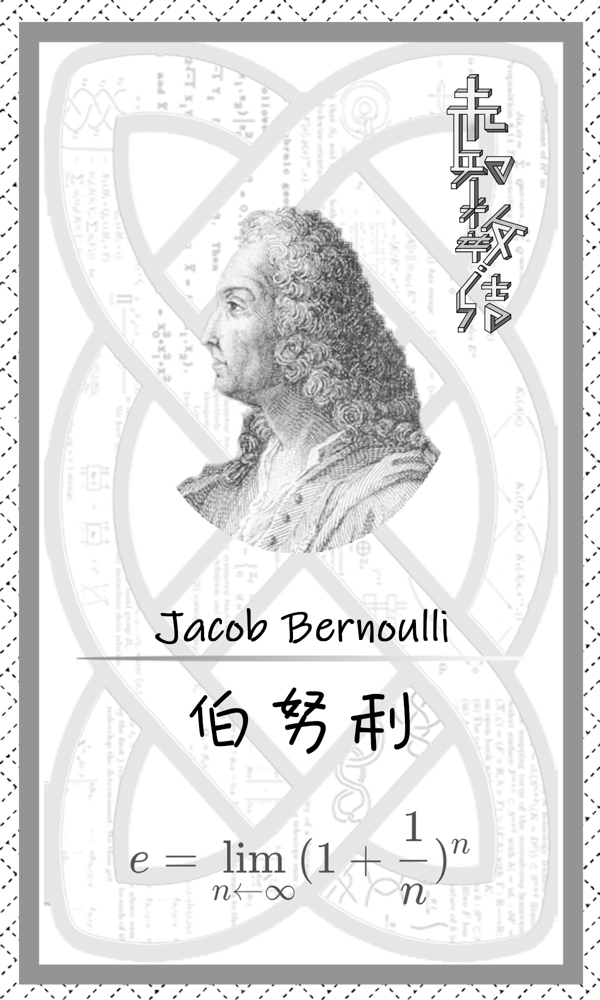

# 数学系学生节抽奖软件


## Project Tree
```
抽奖软件
├─ css
│  └─ styles.css
├─ img
│  ├─ bkg.png
│  ├─ bkgg.png
│  ├─ bkggg.png
│  ├─ card
│  │  ├─ tuo.png
│  │  ├─ 伯努利.png
│  │  ├─ 傅里叶.png
│  │  ├─ 刘徽.png
│  │  ├─ 华罗庚.png
│  │  ├─ 康托尔.png
│  │  ├─ 拉格朗日.png
│  │  ├─ 斐波那契.png
│  │  ├─ 柯西.png
│  │  ├─ 欧几里得.png
│  │  ├─ 欧拉.png
│  │  ├─ 毕达哥拉斯.png
│  │  ├─ 泰勒.png
│  │  ├─ 狄利克雷.png
│  │  ├─ 祖冲之.png
│  │  ├─ 笛卡尔.png
│  │  ├─ 罗素.png
│  │  ├─ 芝诺.png
│  │  ├─ 莱布尼茨.png
│  │  ├─ 费马.png
│  │  ├─ 阿贝尔.png
│  │  ├─ 陈景润.png
│  │  ├─ 陈省身.png
│  │  └─ 高斯.png
│  ├─ logo.png
│  ├─ shu.png
│  └─ 未知数 结.png
├─ index.html
├─ js
│  └─ main.js
├─ README.md
└─ 抽奖软件.zip

```

## 使用说明
1. 解压
2. 使用Google Chrome 浏览器打开index.html
3. 按```F11```全屏
4. 按照下面的对应功能使用
5. 可以实现鼠标全程不出现

## 对应功能
按下对应按键实现相应功能：
1. 抽奖部分
   - ```Q``` 抽取幸运奖
     - 中国数学家
   - ```W``` 抽取三等奖
     - 数学家
     - 末尾数字奇偶性
   - ```E``` 抽取二等奖
     - 数学家
     - 十位数字奇偶性
     - 个位数字
   - ```R``` 抽取一等奖 
     - 数学家
     - 十位数字
     - 个位数字
   - ```P``` 抽取黑幕：莱布尼茨93
2. 单个重抽部分
   -  ```A``` 单独抽取 全部数学家
   -  ```S``` 单独抽取 奇偶性
   -  ```D``` 单独抽取 数字0~9 
   -  ```F``` 单独抽取 数字00~99
3. 其他
   - ```z``` 回到开始状态
   - ```X``` 清屏

## 已知的尽量避免的部分
1. 每次抽奖持续5.5($=\sum_{i=1}^{10} i *0.1s$)s，直到最后停下再让主持人宣布
2. 多个按键以最后一个为准
3. 抽奖中途无法暂停


## 某一次更新之后的问答

html仅仅只是前端界面部分，前端内部逻辑的实现都在main.js文件里面

如果想问的是html中的组件，事实上如下面这段代码，组件中的id属性代表了组件的名字，可以见到我们在后面依据名字对他的属性进行了改变，src属性代表了显示图片的路径，这个用的是相对路径。

```

```

我们在之前每个数学家的“名字”和“照片”建立了一个列表的对应（就是起了一个id，比如刘徽的id就是0），因此相当于程序随机的仅仅只是id这个自然数，而显示的就是名字和照片了。（如下）

```
var mathematicians_china = [
	"刘徽",
	"祖冲之",
	"陈景润",
	"华罗庚",
	"陈省身"
]

var mathematicians_china_src = [
	"img/card/刘徽.png",
	"img/card/祖冲之.png",
	"img/card/陈景润.png",
	"img/card/华罗庚.png",
	"img/card/陈省身.png"
]
```

每一个动画事实上分为两个部分，一个是单纯的演示用动画，这个就是简单的代码写的循环。在最后输出结果的时候，事实上是单纯的再进行了一次独立的抽取，（如下）

```

function f_mathx(){
  //抽取数学家
	!async function f_math() {
    //单纯的演示动画
		for (let i = 0; i < 100; i++)
		{
			await sleep(i)
			var randomNumber = i % mathematicians_en.length;
			document.getElementById("mathematician_").innerHTML = mathematicians_en[randomNumber]
			document.getElementById("mathematician").innerHTML = mathematicians_zh[randomNumber]
			document.getElementById("cardd").src = mathematicians_zh_src[randomNumber]
		}
    //实际上的随机数抽取
		await sleep(400)
			var randomNumber = Math.floor(Math.random() * mathematicians_en.length);
			document.getElementById("mathematician_").innerHTML = mathematicians_en[randomNumber]
			document.getElementById("mathematician").innerHTML = mathematicians_zh[randomNumber]
			document.getElementById("cardd").src = mathematicians_zh_src[randomNumber]

	}()				
}
```

基本就是这样了，希望能够有所帮助~

## 关于
ykx写的，有问题找他
微信号: 同git账号


